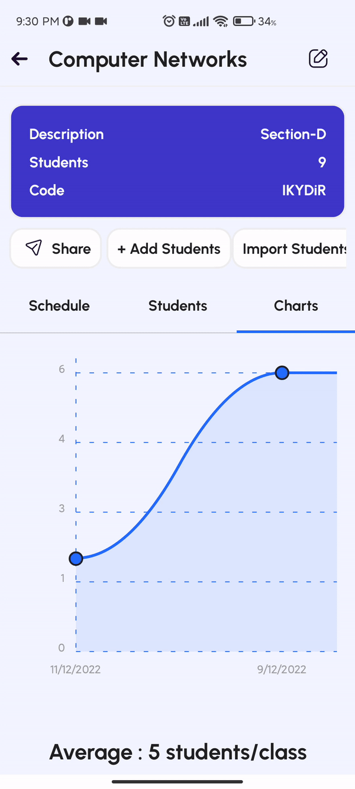

## Attendu

An attendance management app developed using react-native typescript using firebase firestore NoSQL database.

Firebase authentication is used for authenticating the user.

To replicate this project on your system.

-   clone this repository

```

git clone https://github.com/Shaleel/attendu

```

-   Installing devDependencies

```

cd attendu

npm install

```

-   add `google-service.json` file into `android/app/src` .

To obtain firebase credentials visit <a  href="https://console.firebase.google.com/">firebase console</a>

##Screenshots



